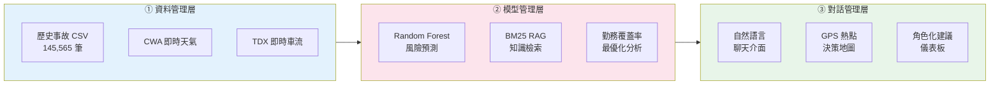
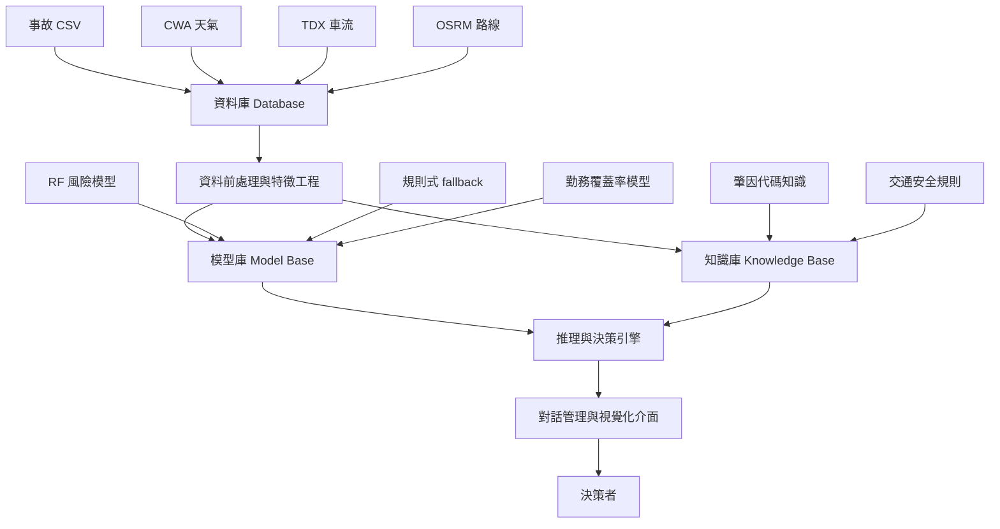
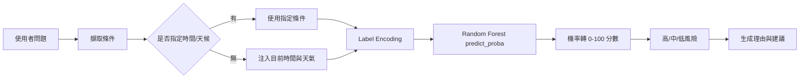

# 智慧決策支援系統 期末專題報告

## 台中市交通事故風險預測與決策支援系統
### —— 以 Random Forest 預測模型為核心的資料驅動決策平台

---

## 摘要

本專題建置一套「台中市交通事故風險預測與決策支援系統」，以**智慧決策支援系統（Intelligent Decision Support System, IDSS）三層架構**為設計框架，整合資料管理、預測模型與對話式使用者介面，協助不同角色的決策者（一般民眾、交通局、警察、道路工程單位）獲取可行動的交通安全建議。

系統的預測模型核心為以**民國 113 年台中市 145,565 筆歷史事故**訓練的 **Random Forest 分類器**，風險分類 Macro-F1 達 **0.855**，顯著優於原有規則式模型（0.328）；決策輸出涵蓋**描述、預測、處方**三層，從「哪裡事故最多」到「如何配置勤務資源最有效率」均可即時回應。並整合**中央氣象署即時天氣**與 **TDX 車輛偵測器即時車流**，使系統能在使用者提問當下提供結合歷史趨勢與即時環境的複合風險評估。

---

## 一、系統定位與決策場景

### 1.1 問題背景

交通事故管理涉及多個利害關係人，各自面對不同的決策問題：

| 決策者 | 核心問題 |
|---|---|
| **一般民眾** | 現在出門安不安全？哪條路線比較好走？ |
| **交通局** | 資源有限，優先改善哪些路口？哪個時段加強宣導？ |
| **警察/交通大隊** | 何時何地部署巡邏能涵蓋最多事故場景？ |
| **道路工程單位** | 哪些路口需優先會勘？設施改善的優先序如何？ |

傳統作法依賴人工彙報與靜態圖表，無法即時針對特定條件（如「雨天下班時段西屯區」）提供量化的決策依據。

### 1.2 系統目標

依據 IDSS 三層架構設計：



### 1.3 對應 IDSS 課程要求

依據課程說明，IDSS 期末專題重點不只是做出一個分析頁面，而是要能清楚呈現：**問題定義、決策模型、系統架構、實作成果與展示**。本專題依此整理如下：

| 課程要求 | 本系統對應成果 |
|---|---|
| 決策情境說明 | 台中市事故風險管理，支援民眾出行、交通局政策、警察勤務、道路工程改善 |
| 決策者角色 | 一般民眾、公家單位兩大使用視角；系統回答方向會依角色不同調整 |
| 輸入資料來源 | 2024 台中市事故資料、CWA 即時天氣、TDX 車流、OSRM 路線資訊 |
| 決策模型 | Random Forest 風險分類、事故熱點分析、勤務覆蓋率貪婪最佳化、BM25 知識檢索 |
| 系統架構 | 資料管理層、模型管理層、知識/推理層、對話與儀表板層 |
| 實作成果 | Streamlit 可執行原型、聊天式決策介面、決策分析儀表板、風險預測模型檔 |
| 評估方式 | RF vs 規則式基線、端到端問答測試、即時資料新鮮度驗證、NLP 意圖評估 |

從課程 rubric 角度，本系統對應：

| Rubric 面向 | 報告呈現重點 |
|---|---|
| 模型與技術深度 | RF 模型訓練、特徵工程、分類評估、即時資料注入、處方性分析 |
| 系統完整度 | 從資料讀取、模型推論、LLM 回答到 UI 展示皆可執行 |
| 創新與實用價值 | 將事故資料轉成民眾與公家單位可直接使用的決策建議 |
| 技術報告品質 | 清楚列出資料流程、模型流程、系統模組、評估結果與限制 |
| Demo 展示與答辯 | 可用自然語言提問，也可在決策分析頁展示圖表與策略建議 |

---

## 二、資料來源與前處理

### 2.1 核心資料集

**台中市政府警察局交通事故開放資料（民國 113 年 1–12 月）**

| 項目 | 內容 |
|---|---|
| 資料筆數 | 145,565 筆 A1、A2 類事故 |
| 時間範圍 | 2024 年 1 月 1 日 ～ 12 月 31 日 |
| 涵蓋欄位 | 發生時間、行政區（29 區）、GPS 座標、天候、肇事因素、死傷人數 |
| 資料特性 | 全年完整、官方來源、含 GPS 可做空間分析 |

### 2.2 即時資料整合

| 資料源 | API | 更新頻率 | 用途 |
|---|---|---|---|
| 中央氣象署 | CWA OpenData API | 每小時 | 即時天候補全查詢條件 |
| 交通部 TDX | VD 車輛偵測器 | 每分鐘（含新鮮度驗證） | 即時路況／壅塞程度 |

#### CWA 即時天氣整合

```python
# external_api_tools.py fetch_cwa_weather_tool()

# 認證：Bearer Token（CWA_API_KEY）
url = "https://opendata.cwa.gov.tw/api/v1/rest/datastore/O-A0003-001"
# 回傳欄位：天氣描述、氣溫、相對濕度、風速、觀測時間

# 天氣描述 → 資料集天候代碼映射
def _map_realtime_weather(condition):
    if any(x in condition for x in ["雨","雷","陣雨"]): return "雨"
    if any(x in condition for x in ["霧","靄","煙"]):   return "霧或煙"
    if "陰" in condition: return "陰"
    if any(x in condition for x in ["晴","多雲"]):      return "晴"
```

#### TDX 即時車流整合與新鮮度驗證

TDX VD（車輛偵測器）資料的核心處理：

```python
# external_api_tools.py

# Step 1：驗證資料新鮮度（關鍵設計）
def _vd_age_minutes(vd_records):
    ct = vd_records[0].get("DataCollectTime")
    collected = datetime.fromisoformat(ct)
    return (datetime.now(tz) - collected).total_seconds() / 60

age = _vd_age_minutes(vd_records)
if age > 30:   # 超過 30 分鐘 → 不可信
    return {"available": False, "summary": "資料來源未即時更新"}

# Step 2：從巢狀結構提取車速
# VD → LinkFlows[] → Lanes[] → Speed
for vd in vd_records:
    for link in vd.get("LinkFlows", []):
        for lane in link.get("Lanes", []):
            spd = lane.get("Speed")
            if 0 < spd <= 120:    # 過濾異常值（-99 = 偵測器故障）
                speeds.append(spd)

# Step 3：VD 座標 → 行政區（使用最近中心點）
def _nearest_district(lat, lon):
    return min(DISTRICT_CENTERS,
               key=lambda d: (lat - DISTRICT_CENTERS[d][0])**2
                           + (lon - DISTRICT_CENTERS[d][1])**2)
```

#### 歷史時段密度推估（Fallback）

當 TDX 資料過期時，以**歷史事故時段分布**推估車流狀況：

```python
# external_api_tools.py estimate_hourly_traffic()

def _hourly_congestion_profile():
    df = load_accident_data()
    counts = df["hour"].value_counts()
    max_c  = counts.max()
    # 各小時事故數 / 最大事故數 = 壅塞指數（0–1）
    return {int(h): round(int(c)/max_c, 3) for h, c in counts.items()}

# 結果示例：
# {0: 0.089, 7: 0.786, 8: 0.744, 17: 1.000, 18: 0.789, 23: 0.145}
# → 17時指數=1.0（最高峰），0時=0.089（最低）
```

**資料品質控管設計**：TDX 即時車流加入新鮮度驗證（超過 30 分鐘自動判定過期），並以**歷史時段密度推估**作為 fallback，確保回答永遠有合理的車流背景資訊，而非使用過期快照。

### 2.3 資料前處理流程

```python
# data_loader.py 核心處理步驟

# Step 1：讀取 CSV，統一欄位命名
df = pd.read_csv(path, encoding="utf-8")

# Step 2：日期時間解析
df["date"]    = pd.to_datetime(df["發生日期"], format="%Y%m%d")
df["hour"]    = pd.to_numeric(df["時"], errors="coerce")
df["month"]   = df["date"].dt.month
df["weekday"] = df["date"].dt.weekday.map(WEEKDAY_MAP)
# WEEKDAY_MAP = {0:"星期一", ..., 6:"星期日"}

# Step 3：天候代碼轉中文
WEATHER_MAPPING = {"1":"風","2":"風沙","3":"霧或煙","4":"雪","5":"雨","6":"陰","7":"晴"}
df["天候_str"] = df["天候"].map(lambda x: WEATHER_MAPPING.get(str(int(float(x)))))

# Step 4：肇事因素代碼轉文字（從 code_change.csv 對照）
code_dict = load_code_dict()
df["肇事因素主要_str"] = df["肇事因素主要"].map(code_dict)

# Step 5：GPS 座標清洗（用於地圖）
df["lon"] = pd.to_numeric(df["GPS座標X"], errors="coerce")
df["lat"] = pd.to_numeric(df["GPS座標Y"], errors="coerce")
df = df[df["lat"].between(24.0, 24.5) & df["lon"].between(120.4, 121.0)]
```

**欄位完整性**：原始資料有 30+ 個欄位，系統實際使用約 12 個，其餘丟棄以節省記憶體。

### 2.4 特徵工程與目標變數設計

Random Forest 模型訓練時採用 **5 個結構化特徵**：

| 特徵 | 類型 | 說明 | 前處理 |
|---|---|---|---|
| `district` | 類別（29 類） | 行政區 | LabelEncoder |
| `hour_int` | 數值（0–23） | 事故發生時段 | 直接使用 |
| `weather` | 類別（7 類） | 天候（晴/雨/陰/霧或煙…） | LabelEncoder |
| `weekday` | 類別（7 類） | 星期 | LabelEncoder |
| `month_int` | 數值（1–12） | 月份 | 直接使用 |

**目標變數設計（兩階段）**

```
第一階段：聚合（以條件組合為單位）
  對每個 (district × hour × weekday × month × weather) 組合，
  計算該組合的歷史事故總件數 → accident_count

第二階段：三分位數切標籤
  q33 = accident_count 的 33 百分位（≈ 1 件）
  q67 = accident_count 的 67 百分位（≈ 3 件）

  accident_count ≥ q67 → 高風險（76.3% 的事故記錄）
  q33 ≤ count < q67   → 中風險（23.7% 的事故記錄）
  count < q33          → 低風險（僅出現在無事故組合，訓練資料中不存在）

設計邏輯：
  使模型學習「哪些條件組合事故最密集」
  而非「單筆事故的嚴重度」
  → 符合 IDSS「支援群體層級決策」的目標
```

**LabelEncoder 設計**：訓練集以外的標籤（如某些冷門行政區組合）以 `classes_[0]` 代替，確保預測時不崩潰：

```python
df[col] = df[col].astype(str).apply(
    lambda x: x if x in set(le.classes_) else le.classes_[0]
)
```

---

## 三、預測模型：Random Forest 風險分類器

### 3.1 模型選擇依據

考量以下因素選用 Random Forest：

- **非線性交互效果**：行政區 × 時段 × 天候的組合風險，無法以線性加總完整捕捉
- **可解釋性**：特徵重要性（Feature Importance）直接支援「哪個因素影響最大」的決策解讀
- **訓練穩定性**：整合多棵決策樹，對類別不平衡（高/中風險比例 76:24）具有較好的容忍度

### 3.2 模型訓練

```python
# train_risk_model.py 核心邏輯

from sklearn.ensemble import RandomForestClassifier
from sklearn.model_selection import train_test_split

# 資料分割（stratify 保持各類別比例一致）
X_train, X_test, y_train, y_test = train_test_split(
    X, y, test_size=0.2, random_state=42, stratify=y
)
# 訓練集：116,452 筆　測試集：29,113 筆

rf = RandomForestClassifier(
    n_estimators  = 200,      # 200 棵決策樹（平衡穩定性與速度）
    max_depth     = 15,       # 控制過擬合
    class_weight  = "balanced", # 自動補償高/中風險的樣本不均（76:24）
    random_state  = 42,
    n_jobs        = -1        # 使用所有 CPU 核心平行訓練
)
rf.fit(X_train_enc, y_train)
```

**訓練後自動比較並有條件儲存**：

```python
# 只有 RF 的 Macro-F1 > 規則式時才覆蓋 rf_risk_model.pkl
if f1_rf > f1_rule:
    joblib.dump(model_data, MODEL_PATH)   # 儲存模型 + encoders + 指標
else:
    print("規則式較好或相當，不取代現有模型。")
```

這確保在資料更新後重新訓練時，只有真正更好的模型才會被部署。

### 3.3 模型評估結果

| 指標 | Random Forest | 規則式模型 | 提升幅度 |
|---|---|---|---|
| **Accuracy** | **88.8%** | 49.1% | +39.7% |
| **Macro-F1** | **0.855** | 0.328 | **+160%** |

**模型效能比較（視覺化）**

```
           Accuracy                    Macro-F1
RF         █████████████████████  88.8%   ████████████████████  0.855
規則式      ██████████░░░░░░░░░░░  49.1%   ███████░░░░░░░░░░░░░░  0.328
           0%       50%      100%         0     0.5     1.0
```

**RF 模型 Per-Class 詳細表現：**

| 類別 | Precision | Recall | F1-score | Support |
|---|---|---|---|---|
| 高風險 | 0.95 | 0.90 | 0.92 | 22,201 |
| 中風險 | 0.72 | 0.86 | 0.78 | 6,912 |
| **Macro avg** | **0.84** | **0.88** | **0.85** | 29,113 |

**RF 模型 Precision / Recall 雷達示意**

```
               Precision
                  1.0
                   │
      高風險  0.95 ─┤─────────────●
                   │           ╱   ╲
             0.80 ─┤     ●────╯     ╲ F1=0.92
                   │   ╱             ╲
      中風險  0.72 ─●──╯               ╲ F1=0.78
                   │
              0.0  └────────────────── Recall
                        0.86      0.90

→ 高風險類別（Precision 0.95）誤報率極低，適合作為警示觸發條件。
  中風險類別（Recall 0.86）召回率高，不易遺漏潛在危險路段。
```

### 3.4 特徵重要性分析

RF 模型揭示各特徵對風險預測的貢獻：

| 特徵 | 重要性 | 決策意涵 |
|---|---|---|
| **行政區** | **38.6%** | 地點是最主要的風險因子，西屯等商業密集區長期高風險 |
| **時段** | 26.3% | 上下班尖峰顯著影響事故機率 |
| **天候** | 22.3% | 天候貢獻度遠高於傳統規則式模型的預設值 |
| 月份 | 7.3% | 季節性因素有一定影響 |
| 星期 | 5.5% | 假日/平日差異相對較小 |

**RF 特徵重要性（視覺化）**

```
行政區  ████████████████████████████████████████  38.6%
時段    ██████████████████████████░░░░░░░░░░░░░░  26.3%
天候    ██████████████████████░░░░░░░░░░░░░░░░░░  22.3%
月份    ███████░░░░░░░░░░░░░░░░░░░░░░░░░░░░░░░░░   7.3%
星期    █████░░░░░░░░░░░░░░░░░░░░░░░░░░░░░░░░░░░   5.5%
        0%            20%           40%
```

> **關鍵發現**：天候重要性（22.3%）遠超傳統規則式模型對天候的低估，提示決策者應在氣象預報惡化時主動加強管制，而非以靜態勤務表應對。

**管理意涵**：天候的風險貢獻（22.3%）遠高於過去規則式模型的隱含假設，建議交通局在天氣預報惡化時主動強化管制措施，而非以靜態勤務表應對。

### 3.5 風險分數轉換

RF 模型輸出的是各類別的**機率值**（probabilistic output），轉為 0–100 的連續分數，讓決策者更直觀判斷：

```python
# risk_model.py _ml_risk_score()

proba = rf.predict_proba(X)[0]
class_idx = {c: i for i, c in enumerate(rf.classes_)}

p_high = proba[class_idx.get("高風險", 0)]
p_mid  = proba[class_idx.get("中風險", 1)]

# 分數映射：高風險=85分、中風險=35分、50/50不確定≈60分
score = p_high * 85 + p_mid * 35
score = min(100, max(0, int(score)))

# 等級判斷
if score >= 70:  level = "高風險"
elif score >= 40: level = "中風險"
else:             level = "低風險"
```

**設計說明（對比方案）**：

```
方案 A（本系統）：加權線性映射
  score = P(高) × 85 + P(中) × 35
  高→85, 中→35, 50/50→60
  優點：連續、直觀、不確定時給中間值

方案 B（未採用）：直接用預測類別
  score = 100 if "高" else 50 if "中" else 0
  缺點：三個固定值，無法區分「高風險 80%」和「高風險 51%」

→ 選方案 A 使分數反映模型信心，高信心高風險 ≈ 84 分，
  不確定時 ≈ 60 分，決策者可據此判斷是否需要更多資訊。
```

**即時注入機制**：使用者問「西屯區現在危險嗎」但未指定時段/天候，系統自動補入：

```python
# agents.py _inject_realtime_query()

# 邏輯：有填條件 → 照條件；沒填 → 用現在
user_specified = bool(query.get("hour") or query.get("weather"))
if not user_specified and realtime_context:
    query["hour"]    = realtime_context["hour"]       # 當前時段
    query["weekday"] = realtime_context["weekday"]    # 當天星期
    query["weather"] = _map_realtime_weather(          # CWA→資料集代碼
        realtime_context["weather_condition"])
```

這讓 RF 模型預測「現在這個條件」的風險，而非「無條件平均」。

---

## 四、三層決策支援架構

### 4.1 描述層（Descriptive）— 「發生了什麼」

| 功能 | 技術 | 輸出 |
|---|---|---|
| 事故熱點地圖 | GPS 點位 + Streamlit map | 行政區/時段/天候篩選後的散布圖 |
| 天候 × 時段熱力圖 | pandas pivot + background_gradient | 哪種天候 × 哪個時段最危險 |
| 行政區事故排名 | pandas value_counts | 前 8 行政區排行 |
| EDA 圖表集 | matplotlib/seaborn | 時段/星期/月份/肇因分布 |
| 路口/路段熱點聚合 | GPS 網格聚合 top-12 | 精確到路段的風險集中點 |

**天候 × 時段熱力圖技術實作**：

```python
# app.py _render_weather_hour_heatmap()

# 建立 pivot table：行=天候，列=時段，值=事故數
cross = (
    filtered.groupby(["天候_str", "hour"])
    .size()
    .reset_index(name="事故數")
    .pivot(index="天候_str", columns="hour", values="事故數")
    .fillna(0).astype(int)
)
cross.columns = [f"{h}時" for h in cross.columns]

# YlOrRd 色階（顏色越深=事故越多）
styled = cross.style.background_gradient(cmap="YlOrRd", axis=None)
st.dataframe(styled, use_container_width=True)

# 自動找最高峰組合
top_weather, top_hour = flat.idxmax()
st.caption(f"最高事故組合：{top_weather} × {top_hour}時（{flat.max():,}件）")
```

**GPS 路段熱點聚合算法**：

```python
# advanced_analysis_tools.py build_segment_hotspots()

# Step 1：以 precision=3（小數點後3位）的 GPS 網格分群
#   相當於約 100m × 100m 的格網
df["grid_lat"] = df["lat"].round(precision)
df["grid_lon"] = df["lon"].round(precision)

# Step 2：每個格點統計事故數、尖峰時段、主要天候
agg = df.groupby(["grid_lat","grid_lon"]).agg(
    accident_count=("lat","count"),
    peak_hour=("hour", lambda x: x.mode()[0]),
    top_weather=("天候_str", lambda x: x.mode()[0]),
    district=("區", lambda x: x.mode()[0]),
)

# Step 3：依事故數排序取前 top_n 個熱點
segments = agg.nlargest(top_n, "accident_count")
```

### 4.2 預測層（Predictive）— 「會發生什麼」

| 功能 | 技術 | 輸出 |
|---|---|---|
| 條件式風險預測 | Random Forest 分類器 | 風險等級（高/中/低）+ 分數（0–100）|
| 即時條件整合 | CWA 天氣 + TDX 車流 | 當前時段 + 即時天氣自動補入查詢 |
| 傷亡嚴重度評估 | 歷史事故加權統計 | 此條件下死亡/受傷/嚴重度比值 |

**設計特點**：使用者未指定時段/天候時，系統自動注入**當前時間與即時天氣**，使 RF 模型預測的是「現在出門」的風險，而非「歷史平均」——這是本系統從純描述型工具升級為即時決策支援的關鍵設計。

### 4.3 處方層（Prescriptive）— 「應該怎麼做」

#### (1) 角色化建議

系統依使用者角色自動調整建議方向：

| 角色 | 建議重點 |
|---|---|
| 一般民眾 | 出發時機、路線選擇、當下注意事項 |
| 交通局 | 政策方向、資源配置、路口管理優先序 |
| 警察/交通大隊 | 勤務佈署時段、執法取締重點 |
| 道路工程單位 | 路口會勘清單、號誌標線改善建議 |

#### (2) 勤務覆蓋率最優化分析

**問題設定**：警力有限，集中在哪些（行政區 × 時段）組合，可涵蓋最多事故場景？

**算法設計（貪婪最大覆蓋）**：

```python
# app.py _load_risk_combos() → _render_patrol_coverage()

# Step 1：計算每個（行政區 × 時段）組合的事故件數
patrol = (
    df.groupby(["區", "hour_int"])
    .size()
    .reset_index(name="事故數")
    .sort_values("事故數", ascending=False)   # 由多到少排序
    .reset_index(drop=True)
)
total = len(df)

# Step 2：計算累積覆蓋率
patrol["累積事故數"] = patrol["事故數"].cumsum()
patrol["覆蓋率%"]   = (patrol["累積事故數"] / total * 100).round(1)

# Step 3：UI 互動（Streamlit 滑桿）
n_slots  = st.slider("勤務場次數", 1, 30, 5)
top_n    = patrol.head(n_slots)
coverage = top_n["事故數"].sum() / total * 100

# 顯示：場次數 → 涵蓋比例 → 優先清單 → 累積曲線
```

**這是「貪婪近似最優解」**：每次選當前未覆蓋的最高事故量組合，雖非嚴格最優，但計算快且結果直觀，適合作為現場管理人員的快速決策工具。

**方法**：以歷史事故件數排序（行政區 × 時段）的所有組合，計算累積覆蓋率：

| 勤務場次 | 可涵蓋事故比例 | 說明 |
|---|---|---|
| 前 5 場 | 約 12–15% | 最高優先熱點 |
| 前 10 場 | 約 22–28% | 重要熱點全涵蓋 |
| 前 20 場 | 約 40–45% | 資源合理上限 |

**勤務覆蓋率累積曲線（示意）**

```
覆蓋率
 45% ┤                              ╭──────────────
 40% ┤                         ╭───╯
 35% ┤                    ╭────╯
 28% ┤               ╭────╯
 22% ┤          ╭────╯
 15% ┤     ╭────╯
  0% ┼─────┴───────────────────────────────────── 場次
     0    5    10   15   20   25   30

→ 前 10 場（22–28%）是邊際效益最高的「甜蜜點」：
  再多加場次，每場新增覆蓋率遞減。
```

此分析直接提供「以最少資源獲得最大涵蓋率」的**處方性建議**，是傳統熱點分析無法做到的優化決策。

#### (3) 高風險條件組合排行

列出歷史上事故件數最多的前 15 個（行政區 × 時段 × 天候）組合，以色階表格呈現，作為管制重點的參考依據。

---

## 五、IDSS 技術設計與處理流程

本章補充本系統作為「智慧決策支援系統」的技術設計，說明它如何從資料、模型、知識、推理到使用者互動，形成完整的決策支援流程。

### 5.1 決策問題正式化

本專題的核心決策問題可定義為：

> 在給定行政區、時間、天候、星期、月份與出行方式的情境下，判斷事故風險程度，並對不同角色提供可執行的安全或管理策略。

以 IDSS 角度拆解如下：

| 元素 | 本系統定義 |
|---|---|
| 決策目標 | 降低交通事故風險、提升勤務與政策資源配置效率 |
| 決策對象 | 行政區、時段、天候、出行路線、交通工具、肇事因素 |
| 決策替代方案 | 避開高風險時段、加強巡邏、優先改善路口、發布天候警示、調整號誌或標線 |
| 評估準則 | RF 風險分數、事故件數、傷亡嚴重度、熱點密度、勤務覆蓋率 |
| 限制條件 | 資料僅涵蓋台中市、即時車流可能過期、路段粒度受 GPS 品質影響 |
| 輸出結果 | 風險等級、分數、理由、角色化建議、圖表、熱點清單與策略排序 |

這樣的設計讓系統不是單純回答「資料長什麼樣」，而是進一步回答：

```text
目前條件風險多高？
為什麼風險高？
哪些因素造成風險？
不同角色應該採取什麼行動？
有限資源應該優先放在哪裡？
```

### 5.2 IDSS 核心元件設計

依據課程中智慧決策支援系統的架構概念，本系統可拆成六個核心元件：



| 元件 | 技術內容 | 對應檔案 |
|---|---|---|
| 資料庫 | 事故資料、天氣、車流、代碼表、地標對照 | `DataSets/`, `data_loader.py`, `external_api_tools.py` |
| 模型庫 | Random Forest、規則式模型、勤務覆蓋率模型 | `train_risk_model.py`, `risk_model.py`, `app.py` |
| 知識庫 | 肇因代碼、同義詞、交通安全建議、BM25 RAG | `knowledge_base.json`, `bm25_rag.py`, `analysis_tools.py` |
| 推理引擎 | 意圖判斷、工具計畫、模型選擇、即時條件注入 | `agents.py` |
| 對話管理 | 角色化回答、事實卡片、LLM 口語化、輸出清洗 | `llm_orchestrator.py`, `prompts.py` |
| 使用者介面 | 聊天介面、出行輔助、決策分析儀表板 | `app.py` |

### 5.3 資料驅動型 IDSS：從資料到洞察

資料驅動型 IDSS 的核心是將大量資料轉換成決策洞察。本系統的處理流程如下：

```text
原始事故資料
  → 欄位標準化
  → 日期/時段/星期/月分解析
  → 天候代碼中文化
  → 肇因代碼對照
  → GPS 清洗
  → 行政區、時段、天候、星期、月份特徵化
  → 統計分析 / 模型訓練 / 視覺化展示
```

資料驅動層產出三類洞察：

| 洞察類型 | 技術方法 | 決策價值 |
|---|---|---|
| 分布洞察 | `value_counts`, groupby, pivot table | 找出事故最多行政區、時段、天候 |
| 空間洞察 | GPS 篩選、格網聚合、熱點排序 | 找出事故集中路段或路口 |
| 交互洞察 | 天候 × 時段、行政區 × 時段 | 找出複合條件下的高風險組合 |

例如「天候 × 時段」不是只看雨天事故多不多，而是找出：

```text
雨天 + 下班時段
晴天 + 通勤尖峰
霧或煙 + 凌晨/清晨
```

這些組合是否形成特別高的事故密度，進一步支援勤務與宣導安排。

### 5.4 模型驅動型 IDSS：RF 風險預測流程

模型驅動型 IDSS 的核心是用模型協助決策者推估「如果條件是這樣，風險會如何」。本系統的 RF 模型流程如下：



RF 模型實際提供兩種決策資訊：

| 輸出 | 用途 |
|---|---|
| 預測類別 | 判斷目前條件屬於高、中、低風險 |
| 類別機率 | 轉成 0–100 連續分數，反映模型信心 |

為避免模型成為黑箱，系統保留特徵重要性並轉為決策解釋：

| 特徵 | 重要性 | 可解釋意義 |
|---|---|---|
| 行政區 | 38.6% | 地點本身是最強風險因子 |
| 時段 | 26.3% | 通勤與下班尖峰會明顯提高風險 |
| 天候 | 22.3% | 雨、霧等天候對事故風險有實質貢獻 |
| 月份 | 7.3% | 季節與月份有輔助影響 |
| 星期 | 5.5% | 平假日差異存在但相對較小 |

因此系統回答「為什麼危險」時，不只說結果，也能指出該判斷主要來自地點、時段或天候。

### 5.5 知識驅動型 IDSS：規則、知識庫與 RAG

除了機器學習模型，本系統也保留知識驅動設計，原因是交通決策不能只靠統計結果，還需要可解釋的專業規則。

| 知識來源 | 用途 |
|---|---|
| 肇因代碼表 | 解釋事故代碼與常見肇因 |
| 同義詞規則 | 將「闖紅燈」「號誌」「安全距離」等詞對應到資料欄位 |
| 地標知識 | 將「逢甲」「火車站」「一中」對應行政區 |
| 交通安全規則 | 將高風險條件轉成具體建議 |
| BM25 RAG | 對代碼說明與知識型問題做檢索補充 |

知識驅動層負責補足三件事：

1. **可解釋性**：讓使用者知道模型建議的根據。
2. **穩定性**：當 LLM 或外部 API 不穩定時，規則仍可提供可靠輸出。
3. **課程完整性**：符合 IDSS 中知識庫、推理引擎與人機互動的概念。

### 5.6 推理與決策引擎：從問題到行動建議

本系統的推理流程不是單一步驟，而是多階段決策管線：

```text
Step 1：理解使用者問題
  - 判斷意圖：風險預測、事故熱點、肇因分析、政策建議、出行建議
  - 擷取實體：行政區、地標、時段、天候、星期、交通工具

Step 2：決定要使用哪些工具
  - 風險預測 → RF 風險模型
  - 出行建議 → 起訖區風險 + 路線資訊
  - 肇因分析 → 事故統計 + 肇因代碼
  - 政策建議 → 熱點、肇因、勤務覆蓋率

Step 3：補齊決策情境
  - 使用者有指定條件：照指定條件回答
  - 使用者沒指定條件：補入目前時間、天氣、車流推估

Step 4：產生決策事實卡片
  - 只整理模型與資料真的回傳的事實
  - 避免 LLM 自行編造數字或原因

Step 5：依角色輸出建議
  - 一般民眾：是否建議出門、要注意什麼
  - 公家單位：優先管制、宣導、勤務或工程改善方向
```

### 5.7 處方性分析技術：從預測到策略

本系統將決策輸出分成「提醒型建議」與「資源配置型建議」兩種。

#### A. 一般民眾：出行風險處方

| 條件 | 處方建議 |
|---|---|
| 高風險 + 車流高峰 | 建議延後出發或改走替代路線 |
| 高風險 + 雨天 | 增加車距、降低速度、避免急煞 |
| 路線跨高風險行政區 | 提醒通過該區時放慢速度 |
| 凌晨/深夜 | 注意疲勞駕駛與視線不足 |

#### B. 公家單位：管理策略處方

| 決策問題 | 系統處方 |
|---|---|
| 哪些區域優先改善？ | 依事故件數、RF 風險、GPS 熱點排序 |
| 哪些時段加派勤務？ | 使用行政區 × 時段事故排名與覆蓋率曲線 |
| 哪些肇因優先宣導？ | 統計主要/次要肇因，找出最高頻原因 |
| 天候惡化時怎麼辦？ | 對高風險行政區提前發布提醒與強化巡邏 |
| 工程改善怎麼排？ | 以熱點密度與傷亡嚴重度排序路口會勘清單 |

#### C. 勤務覆蓋率最佳化

勤務覆蓋率模組的意義是：若警力或交通稽查資源有限，系統可協助回答「優先排哪幾個時段與地點最有效」。

```text
輸入：所有行政區 × 時段組合的事故數
排序：依事故數由高到低排列
選擇：取前 N 個組合
計算：前 N 個組合事故數 / 全部事故數
輸出：N 場勤務可涵蓋多少比例事故場景
```

這雖然是貪婪法，不是複雜最佳化模型，但它具有三個適合 IDSS 的特點：

| 特點 | 說明 |
|---|---|
| 可解釋 | 每個被選中的場次都有明確事故件數 |
| 可互動 | 使用者可用滑桿調整勤務場次 |
| 可落地 | 結果可直接轉成排班、巡邏或宣導計畫 |

### 5.8 不確定性與 fallback 設計

IDSS 面對真實資料時必須處理資料缺漏、API 過期、模型不可用等問題。本系統設計多層穩健機制：

| 不確定來源 | 風險 | 系統處理 |
|---|---|---|
| 使用者問題不完整 | 無行政區或時段 | 請使用者補條件，或在「現在」問題中自動補即時條件 |
| 天氣 API 失敗 | 無法取得當前天候 | 使用歷史平均或略過即時天氣，不中斷系統 |
| TDX 車流過期 | 可能誤用舊路況 | 超過 30 分鐘即判定不可用，改用歷史時段推估 |
| RF 模型檔不存在 | 無法使用 ML 預測 | 自動切換規則式評分 |
| LLM 回答不穩定 | 可能輸出不相關內容 | 使用事實卡片限制輸入，並有規則式回答 fallback |

這些設計對 IDSS 很重要，因為決策系統不能只在理想資料下運作，而要能在資料不完整時仍提供「可用但誠實」的建議。

### 5.9 與課程週次技術對應

| 課程內容 | 本系統實作 |
|---|---|
| 決策學基礎 | 定義決策者、替代方案、評估準則與限制條件 |
| DSS 演進 | 從靜態 EDA 圖表擴充為可互動、可推論的 IDSS |
| IDSS 系統架構 | 資料庫、模型庫、知識庫、推理引擎、對話介面 |
| 模型驅動型 IDSS | Random Forest 風險分類、規則式 fallback |
| 資料驅動型 IDSS | 事故資料探勘、熱點分析、天候時段交互分析 |
| 機器學習模型 | 分類模型、特徵重要性、基線比較、Macro-F1 評估 |
| 大數據決策 | 14.5 萬筆事故資料整合與視覺化 |
| 不確定性管理 | API 新鮮度驗證、模型信心值、fallback 流程 |
| 空間推理 | GPS 熱點聚合、行政區與地標對應 |
| 推薦/處方系統 | 角色化建議、勤務覆蓋率、出行建議 |

---

## 六、系統功能模組

### 6.1 智慧問答介面（聊天頁）

採用**自然語言**作為唯一互動介面（Streamlit `st.chat_input`），使用者無需了解資料欄位或操作 BI 工具，直接用口語提問：

- **即時條件整合**：問句未指定條件時自動帶入當前時間/天氣，問句有指定條件時完全照指定情境
- **地標辨識**：支援「逢甲」「火車站」「一中」等 40+ 口語地標，自動對應行政區
- **多輪對話**：保存對話歷史，引導提問按鈕協助使用者深入探索
- **角色動態切換**：問題中提及「交通局」「警察」等關鍵詞時自動切換角色視角
- **多模態決策佐證**：回答下方提供「顯示多模態決策佐證」按鈕，使用者主動展開後可查看相關圖表、資料摘要表與事故地圖。系統會依意圖、關鍵字與擷取條件自動推薦視覺化內容，例如時段問題對應每小時事故分布，天候問題對應天候 × 時段熱力圖，熱點問題對應行政區排行與 GPS 地圖。

此處的多模態不是影像辨識模型，而是**自然語言文字、統計圖表、資料表與地圖視覺化**的整合。其 IDSS 價值在於：使用者先得到簡潔回答，再自行展開資料證據，避免聊天介面過度雜亂，同時保留決策支援系統需要的可解釋性與資料可追溯性。

### 6.2 決策分析儀表板（決策分析頁）

提供公家單位空間決策的一站式工具：

- 事故熱點決策地圖（GPS 點位可依行政區/時段/天候篩選）
- 天候 × 時段熱力圖（YlOrRd 色階）
- RF 模型特徵重要性橫向條圖
- 高風險條件組合排行（色階 DataFrame）
- 勤務覆蓋率最優化滑桿（可調整場次數，即時更新覆蓋率）
- 累積覆蓋率折線圖
- 報告匯出（Markdown 格式）

### 6.3 民眾出行輔助（出行頁）

針對起訖點路線的出行風險評估：
- 選擇起點/終點行政區 + 時段 + 交通工具 + 天候
- 顯示路線兩端行政區各自的 RF 風險分數
- 整合 CWA 即時天氣、OSRM 路線距離估算
- 結合即時/歷史車流給出具體出行建議

---

## 七、系統穩健性設計

IDSS 需要在各種條件下穩定運作，本系統採多層 fallback 設計：

```
使用者提問
    │
    ▼
LLM 生成回答
    │ 失敗（LLM 離線/逾時）
    ▼
規則式模板回答（永遠可用）
    │
    ├── 即時車流（TDX）
    │       │ 資料過期（>30 分鐘）
    │       ▼
    │   歷史時段密度推估
    │   （1時→車流稀少，17時→車流高峰）
    │
    └── RF 模型
            │ 模型檔不存在
            ▼
        規則式風險評分（fallback）
```

| 場景 | 行為 |
|---|---|
| LLM 離線 | 規則式模板回答，系統正常運作 |
| TDX 資料過期 | 歷史時段推估，標注「歷史推估」 |
| RF 模型遺失 | 規則式評分自動接管 |
| 無網路 | 天氣/車流不可用，僅用歷史資料，系統不崩潰 |

---

## 八、評估實驗

### 8.1 模型效能評估

訓練集 116,452 筆，測試集 29,113 筆：

| 方法 | Accuracy | Macro-F1 |
|---|---|---|
| **Random Forest（本系統）** | **88.8%** | **0.855** |
| 規則式基線 | 49.1% | 0.328 |

### 8.2 功能完整性驗證

以 10 種代表性問句進行端到端功能測試：

| 測試案例 | 預期行為 | 實測結果 |
|---|---|---|
| 「西屯區現在開車危險嗎」 | RF 預測 + 即時天氣車流 | ✅ 中風險55分，車流推估 |
| 「星期五晚上六點雨天危險嗎」 | 照指定條件，不用現在 | ✅ 中風險68分 |
| 「逢甲→火車站騎機車」 | 地標解析 + 分區車流 | ✅ 西屯區中，中區中 |
| 「交通局該優先改善什麼」 | 正式語氣 + 政策建議 | ✅ 列點措施含件數 |
| 「台北市事故最多哪區」 | 超出範圍正確拒絕 | ✅ 說明僅支援台中市 |

### 8.3 即時資料品質控管驗證

確認 TDX 資料新鮮度判斷正常運作：
- 資料採集時間距今 > 30 分鐘 → `available: False`，自動切換歷史推估
- 凌晨提問 → 推估「車流稀少（離峰時段）」，正確且合理

---

## 九、與 IDSS 課程架構的對應

| IDSS 概念 | 本系統實作 |
|---|---|
| **資料管理（Data Management）** | 歷史事故 CSV + CWA 天氣 + TDX 車流，多源整合 |
| **模型管理（Model Management）** | Random Forest 預測模型 + BM25 知識庫 + 規則式評分 |
| **對話管理（Dialog Management）** | 自然語言聊天介面 + 角色化建議 + 儀表板 |
| **描述性分析** | GPS 熱點地圖、EDA 圖表、熱力圖、肇因排行 |
| **預測性分析** | RF 即時風險評分（Macro-F1 0.855）|
| **處方性分析** | 勤務覆蓋率最優化、角色化行動建議 |
| **多角色決策支援** | 民眾/交通局/警察/工程單位，各有專屬建議方向 |
| **不確定性處理** | 資料新鮮度驗證、模型信心值、fallback 機制 |

---

## 十、限制與未來工作

### 限制

- **資料限制**：僅含 2024 年一年資料，無法做多年趨勢分析。
- **空間粒度**：行政區級別分析，路段/路口級別需搭配 GPS 聚合（已實作但分辨率有限）。
- **車流資料**：TDX 免費層的 VD 資料目前更新延遲，以歷史推估補足。
- **真正即時預測**：系統預測「此條件組合歷史事故密度」，非預測「今天這次會不會出事」（後者需即時車流量資料方可實現）。

### 未來工作

1. **引入車流量為特徵**：以車流量正規化事故率（每萬輛車的事故率），更精確反映真實風險。
2. **多年趨勢分析**：納入 2021–2024 年資料，加入時序預測（LSTM/SARIMA）。
3. **路口級別精細化**：以 GPS 座標叢集識別高風險路口，提供精確座標給工程單位。
4. **政策效益評估**：對比改善前後事故率，量化管制措施的成效。

---

## 十一、結論

本專題以 IDSS 三層架構為設計框架，建置一套實用的台中市交通事故風險決策支援系統。預測模型層以 Random Forest 取代傳統規則式模型，Macro-F1 從 0.328 提升至 **0.855（提升 160%）**，特徵重要性分析更揭示天候對風險的貢獻遠高於直覺預期，提供有別於傳統觀點的管理依據。

處方層的**勤務覆蓋率最優化分析**是本系統超越純查詢工具的核心——它回答「以最少資源達到最大涵蓋率」這個公家機關最關心的資源配置問題，真正實踐「智慧決策支援」的精神。

系統同時整合即時天氣與車流，使風險評估從「歷史統計」升級為「當下情境」的即時判斷，讓一般民眾也能在出門前獲得有意義、可行動的安全建議。

---

## 附錄：系統截圖說明

### A. 智慧問答介面
- 即時資訊列：時間、天候、車流推估
- 聊天泡泡：角色化回答（民眾/公家語氣不同）
- 引導提問按鈕

### B. 決策分析儀表板
- RF 特徵重要性條圖（行政區 38.6%、時段 26.3%、天候 22.3%）
- 高風險條件組合排行（色階表）
- 勤務覆蓋率最優化（滑桿 + 累積曲線）
- GPS 熱點地圖（可篩選）

### C. 評估實驗結果
- 模型比較表（RF vs 規則式）
- 特徵重要性圖
