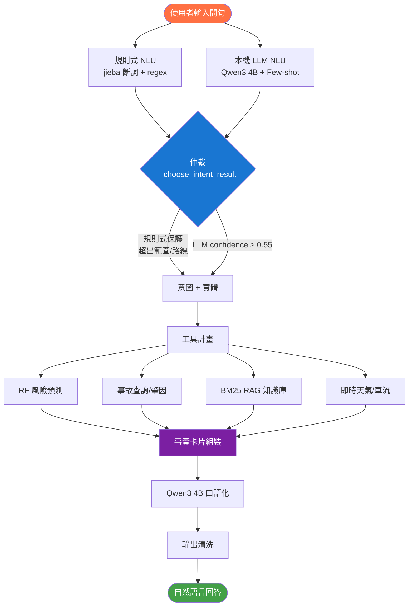

# 自然語言處理 期末專題報告

## 台中市交通事故風險查詢與決策支援系統
### —— 以混合式 NLU 為核心的中文問答系統

---

## 摘要

本專題實作一套「台中市交通事故風險查詢與決策支援系統」，以**自然語言問答**為人機互動主軸，讓使用者用口語提問（如「西屯區星期五晚上六點雨天危險嗎？」），系統即自動完成**意圖辨識、實體擷取、工具執行、知識檢索與自然語言回答**的完整流程。

系統核心為一套**混合式自然語言理解（Hybrid NLU）**架構：以規則式 NLU 處理確定性強的判斷（行政區、時段、天候、地理邊界），並以本機大型語言模型（Ollama + Qwen3 4B）負責語義理解與最終回答生成；同時整合 **jieba 中文斷詞**、**Few-shot Prompting**、**BM25 稀疏檢索（RAG）** 等課程技術。

評估部分將系統拆成「理解層」與「生成層」檢視：理解層以 30 題任務導向測試集評估意圖分類與實體擷取，結果顯示目前規則能覆蓋本專題定義的主要問句類型；生成層則以成功/失敗案例分析檢查回答是否自然、是否依據事實卡片且避免幻覺。本報告完整呈現系統的 NLP 技術設計、評估實驗與優化歷程。

---

## 一、專題動機與目標

### 1.1 問題背景

交通事故開放資料雖然公開，但一般民眾與公務機關難以直接從原始資料表中得到「我現在出門安不安全」「哪個路段該優先改善」這類決策資訊。傳統查詢需要懂得資料欄位、寫程式或操作 BI 工具，門檻高。

### 1.2 專題目標

以**自然語言**作為唯一互動介面，讓使用者「用講的」就能查詢交通事故風險，系統需具備：

1. **理解口語問句** — 從自由文字辨識使用者意圖與條件。
2. **精準擷取條件** — 行政區、時段、星期、天候、交通工具、起訖點等實體。
3. **產生自然、可信的回答** — 結合真實數據與機器學習預測，用口語回覆，且不得編造數字。
4. **離線可運行** — 不依賴雲端 API，以本機 LLM 完成語言生成。

### 1.3 資料來源

台中市政府警察局「**民國 113 年（2024 年）1–12 月 A1、A2 類交通事故開放資料**」，約 14.5 萬筆事故記錄，欄位含發生時間、行政區、GPS 座標、天候、肇事因素、死傷人數等。

### 1.4 使用 API 與外部服務

本系統的 NLP 核心不依賴雲端 LLM API，而是以本機 Ollama 呼叫 Qwen3 4B。其他 API 主要作為「決策背景資料」補充，讓回答能結合當下天氣、車流或路線情境。

| API / 服務 | 用途 | 在系統中的角色 |
|---|---|---|
| Ollama API | 呼叫本機 LLM（Qwen3 4B）進行語義解析與回答生成 | NLP 核心服務 |
| 中央氣象署 CWA API | 取得台中市目前天氣、溫度與降雨狀況 | 即時情境輔助 |
| TDX 交通資料 API | 取得交通流量、速率或車流背景資料 | 即時/準即時車流輔助 |
| OSRM Routing API | 取得路線距離與路線資訊 | 路線建議輔助 |
| 台中市交通事故開放資料 | 事故歷史資料、風險模型訓練與統計分析 | 主要資料來源 |

需要特別說明的是，外部 API 不直接決定最終風險答案。系統的風險判斷仍以台中市 2024 年事故資料、Random Forest 預測模型與統計分析結果為主要依據；天氣、車流與路線 API 則用來補充使用者「現在出門是否危險」這類問題的上下文。

### 1.5 期末專題評分項目對照

依據「NLP Final Project Requirements and Evaluation.pptx」中的評分方式，本專題對應如下：

| 評分項目 | 配分 | 本專題對應成果 |
|---|---:|---|
| 題目設計與應用價值 | 15 | 以台中交通事故風險為主題，服務一般民眾出行與公家單位決策，具真實資料與明確應用場景。 |
| NLP / LLM 技術使用 | 25 | 整合 jieba 斷詞、規則式 NLU、Few-shot Prompting、本機 LLM、BM25 RAG、事實卡片回答生成與輸出清洗。 |
| 系統完成度 | 20 | 完成 Streamlit 聊天介面、多代理人流程、風險預測、路線建議、代碼查詢、政策建議與多模態圖表佐證。 |
| 評估與分析 | 20 | 建立 30 題標註測試集，評估 Accuracy、Macro-F1、Per-Intent F1 與實體擷取準確率，並分析錯誤原因。 |
| 報告與展示 | 10 | 本報告整理系統架構、技術流程、實驗結果、優化歷程與代表性問答，可作為 10–15 分鐘簡報基礎。 |
| 創意與延伸性 | 10 | 將 NLP 問答、交通事故風險模型、即時天氣車流與圖表/地圖佐證整合為決策支援系統。 |

整體而言，本專題不只是將 LLM 套用到聊天介面，而是將自然語言理解、檢索、資料分析與模型預測串成可實際操作的中文問答系統，符合課程對「NLP/LLM 技術使用」與「系統完成度」的要求。

---

## 二、系統架構總覽

系統採用**多代理人管線（Multi-Agent Pipeline）**設計，將一次問答拆解為可追溯的數個階段：

```
使用者問句
    │
    ▼
┌──────────────────────────────────────────┐
│ ① 自然語言理解（NLU）                       │
│   規則式 NLU（jieba 斷詞 + regex + 關鍵詞）  │
│        ＋                                   │
│   本機 LLM NLU（Qwen3 4B + Few-shot）       │
│   → 意圖 intent + 實體 entities            │
└──────────────────────────────────────────┘
    │
    ▼
┌──────────────────────────────────────────┐
│ ② 工具計畫（Tool Plan）                     │
│   依意圖決定要呼叫哪些分析工具               │
└──────────────────────────────────────────┘
    │
    ▼
┌──────────────────────────────────────────┐
│ ③ 工具執行（Tool Execution）                │
│   風險預測(RF) / 事故查詢 / 肇因分析 /       │
│   BM25 RAG 知識檢索 / 即時天氣車流           │
└──────────────────────────────────────────┘
    │
    ▼
┌──────────────────────────────────────────┐
│ ④ 回答生成（Response Agent）                │
│   程式組裝「事實卡片」→ LLM 口語化 → 輸出清洗 │
└──────────────────────────────────────────┘
    │
    ▼
┌──────────────────────────────────────────┐
│ ⑤ 品質檢查（Critic Agent）                  │
│   檢查是否依據資料、是否含禁用詞             │
└──────────────────────────────────────────┘
    │
    ▼
  自然語言回答（Streamlit 聊天介面）
```

**系統架構流程圖**



### 模組對照

| 模組檔案 | 職責 |
|---|---|
| `agents.py` | 多代理人管線主控、規則式 NLU、意圖路由 |
| `text_preprocessor.py` | jieba 斷詞、自訂詞典、地標／行政區對照 |
| `nlu_parser.py` | 本機 LLM 語義解析、Few-shot Prompting |
| `bm25_rag.py` | BM25 稀疏檢索知識庫 |
| `llm_orchestrator.py` | 回答生成、事實卡片組裝、輸出清洗 |
| `local_llm_client.py` | Ollama / llama.cpp 本機 LLM 客戶端 |
| `prompts.py` | 系統提示、回答規則 |
| `nlp_evaluation.py` | NLP 評估實驗腳本 |

---

## 三、NLP 核心技術實作（對應課程週次）

### 3.1 文本前處理：jieba 中文斷詞（對應 Week 2）

中文沒有天然詞界，需先斷詞才能進行關鍵詞比對與檢索。系統以 **jieba** 進行斷詞，並針對交通領域加入**自訂詞典**，避免領域詞被錯誤切分。

```python
# text_preprocessor.py
import jieba
for term in TRANSPORT_VOCAB:      # 交通工具：機車、汽車、自行車…
    jieba.add_word(term)
for alias in DISTRICT_ALIASES:    # 行政區別名：西屯、豐原…
    jieba.add_word(alias)

def tokenize(text):
    return jieba.lcut(text)        # jieba 不可用時 fallback 為逐字
```

**jieba 斷詞效果對比**

```
輸入：「傍晚走北屯區騎自行車安全嗎」

未加自訂詞典：
  傍晚 ｜ 走 ｜ 北屯 ｜ 區 ｜ 騎 ｜ 自行 ｜ 車 ｜ 安全 ｜ 嗎
  ❌ 交通工具：無法識別（自行+車 被切開）

加入自訂詞典後：
  傍晚 ｜ 走 ｜ 北屯區 ｜ 騎 ｜ 自行車 ｜ 安全 ｜ 嗎
  ✅ 行政區：北屯區
  ✅ 交通工具：自行車
```

此外建立**台中地標 → 行政區對照表**（40+ 條），讓口語地標可對應到實際行政區：

| 地標 | 行政區 | 地標 | 行政區 |
|---|---|---|---|
| 逢甲、市政府、七期 | 西屯區 | 火車站、台中公園 | 中區 |
| 一中、科博館 | 北區 | 高鐵站 | 烏日區 |
| 勤美、草悟道 | 西區 | 東海大學 | 龍井區 |

**實例**：「現在從逢甲去火車站危險嗎」→ 起點=西屯區、終點=中區。

---

### 3.2 意圖分類：混合式 NLU（對應 Week 6–7）

系統定義 **9 種意圖**，涵蓋查詢、預測、分析與邊界處理：

| 意圖 | 說明 | 範例 |
|---|---|---|
| 風險預測 | 判斷特定條件危險程度 | 西屯區晚上開車危險嗎 |
| 事故熱點查詢 | 哪個行政區事故最多 | 台中哪區事故最多 |
| 時段查詢 | 哪個時段事故最多 | 什麼時間最容易出事 |
| 肇因分析 | 主要肇事原因 | 最常見肇事原因是什麼 |
| 政策建議 | 給公務機關的建議 | 交通局該優先改善什麼 |
| 代碼說明 | 欄位/代碼解釋 | 肇事因素代碼07是什麼 |
| 民眾出行建議 | 起訖點路線風險 | 從逢甲騎車去火車站安全嗎 |
| 超出資料範圍 | 他縣市/未來事件 | 台北市事故如何 |
| 需要補充條件 | 問句不完整 | 這樣危險嗎 |

#### 3.2.1 規則式 NLU 設計與判斷邏輯

規則式 NLU 以**優先序（Priority Order）**依序檢查，先確定的規則擁有更高優先權：

```
輸入問句（text）
    │
    ├─ Step 1：地理邊界（最高優先）
    │   如果含「台北」「高雄」「桃園」等且不含「台中」
    │   → 超出資料範圍（強制，LLM 不可覆蓋）
    │
    ├─ Step 2：未來/即時事件
    │   regex: 明天|後天|未來.*事故|現在會不會
    │   → 超出資料範圍
    │
    ├─ Step 3：代碼查詢
    │   regex: (代碼|code)\s*\d+ 或含「欄位」
    │   → 代碼說明
    │
    ├─ Step 4：政策建議
    │   關鍵詞: 交通局|政策|管理措施|採取什麼
    │   → 政策建議
    │
    ├─ Step 5：路線模式（強制，LLM 不可覆蓋）
    │   ① 文中 ≥ 2 個行政區 + 含路線詞 → 民眾出行建議
    │   ② regex: 從.{1,12}[到去往]          → 民眾出行建議
    │   ③ 有交通工具 + 有行政區              → 民眾出行建議
    │
    ├─ Step 6：「哪個時段比較安全」→ 時段查詢
    │   regex: 哪個時段.*[安全出門]|幾點.*最安全
    │
    ├─ Step 7：風險詞 vs 時段詞
    │   has_risk = 危險|風險|高嗎|安全嗎|會發生|機率
    │   短問句（≤7字）且無實體且非即時詞 → 需要補充條件
    │   has_risk = True → 風險預測
    │   has_time = True → 時段查詢
    │
    ├─ Step 8：肇因分析
    │   關鍵詞: 肇事|原因|酒駕|飲酒|比例|為什麼
    │
    ├─ Step 9：事故熱點查詢
    │   關鍵詞: 哪個區|行政區|最多|熱點|排名|最集中
    │
    └─ Step 10：需要補充條件（預設）
```

**邊界案例處理**（初版錯誤 → 修正方式）：

| 問句 | 初版判斷 | 問題 | 修正方式 |
|---|---|---|---|
| 「西屯區什麼時段風險最高」 | 時段查詢 ❌ | 「時段」優先於「風險」 | 風險詞在時段詞之前檢查 |
| 「哪個時段從逢甲去火車站比較安全」 | 風險預測 ❌ | 路線被誤判 | Step 5 路線檢查放在 Step 6 之前 |
| 「雨天比較容易發生事故嗎」 | 風險預測 ❌ | 「容易發生」歸屬錯誤 | 移出風險詞，改入熱點查詢 |
| 「現在開車危險嗎」 | 需補充條件 ❌ | 即時詞未排除 | 含「現在/出門/上路」→ 直接走風險預測 |
| 「這樣危險嗎」 | 風險預測 ❌ | 問句太短無條件 | ≤7字且無實體且無即時詞 → 需補充 |

#### 3.2.2 雙層 NLU 仲裁機制

```
規則式 NLU（先執行，~5ms）
   → intent_rule + entities_rule
         │
         ▼
本機 LLM NLU（Qwen3 4B，語義補強，1–3秒）
   Few-shot Prompting 12 個範例
   → intent_llm + confidence（0–1）
         │
         ▼
  _choose_intent_result() 仲裁

  ┌─ 規則式強制保護（LLM 不可覆蓋）：
  │   超出資料範圍、民眾出行建議（路線模式）
  │
  ├─ LLM confidence ≥ 0.55 → 採用 LLM 結果
  │   （語義模糊案例由 LLM 補強）
  │
  ├─ confidence < 0.55 → 採用規則式
  │
  └─ LLM 不可用 → fallback 規則式（離線可運行）
```

**仲裁設計原則**：
- 規則式的「確定性強」判斷（地理邊界、路線）不讓 LLM 覆蓋，即使 LLM 高信心也不行
- LLM 不能把規則式已判定可回答的 intent 降級為「需要補充條件」
- 這讓規則式保證系統下限，LLM 只在確實需要語義理解時才介入

#### 3.2.3 Few-shot Prompting 設計

`nlu_parser.py` 在 LLM 提示中嵌入 **12 個邊界案例**，每個範例附有說明，讓模型學習本系統的分類規則而非通用規則：

```
===== 邊界案例範例（節錄）=====

【邊界1：含「今天」但屬風險預測】
問：今天是星期五下班時間雨天，危不危險？
意圖：風險預測
實體：{weekday: 星期五, hour: 18, weather: 雨}
說明：「今天」是口語語境，使用者在問這個條件危不危險，
      並非詢問「今天即時事故」，應歸風險預測。

【邊界2：天候正規化】
問：起霧天騎車安全嗎？
意圖：風險預測
實體：{weather: 霧或煙}
說明：「起霧」需對應到資料集欄位值「霧或煙」，
      直接使用「霧」會查不到資料。

【邊界3：時段詞 ≠ 時段查詢】
問：西屯區什麼時段風險最高？
意圖：風險預測
實體：{district: 西屯區}
說明：含「時段」但問的是「西屯區的風險」，
      是風險預測而非時段查詢。

【邊界4：出行建議】
問：現在從逢甲騎機車去火車站危險嗎
意圖：民眾出行建議
實體：{origin: 西屯區, destination: 中區, transport: 機車}
說明：有明確起訖點，屬出行建議，不是風險預測。
```

**12 個範例的意圖分布**：風險預測(3)、時段查詢(2)、出行建議(2)、熱點查詢(1)、肇因(1)、政策(1)、超出範圍(1)、需補充(1)。涵蓋所有易混淆的邊界情境。

---

### 3.3 實體擷取

從問句擷取 9 種實體，採 **jieba token 比對 + regex + 詞典正規化** 三層機制：

| 實體 | 擷取方式 | 正規化範例 |
|---|---|---|
| 行政區 | 完整名→別名→地標 | 逢甲 → 西屯區 |
| 時段 hour | regex + 口語對照 | 下班、傍晚 → 18 |
| 星期 | 關鍵詞 | 禮拜五 → 星期五 |
| 天候 | 詞典正規化 | 起霧 → 霧或煙 |
| 交通工具 | jieba token | 騎車 → 機車 |
| 起訖點 | 「從X到Y」模式 + 地標 | 逢甲→火車站 = 西屯區→中區 |

#### 3.3.1 時段（Hour）擷取規則

時段擷取最複雜，需處理數字、口語、前綴等多種表達：

```python
# agents.py _extract_hour() 邏輯

_prefix_patterns = [
    (r"凌晨",  2),   # 凌晨 → 2時
    (r"清晨",  6),   # 清晨 → 6時
    (r"早上",  8),   # 早上 → 8時
    (r"中午",  12),  # 中午 → 12時
    (r"下午",  14),  # 下午 → 14時（若無具體時間）
    (r"傍晚",  18),  # 傍晚 → 18時
    (r"下班",  18),  # 下班 → 18時
    (r"晚上",  20),  # 晚上 → 20時
    (r"深夜",  23),  # 深夜 → 23時
]
_keyword_hours = {
    "中午": 12, "午餐": 12,
    "下班": 18, "傍晚": 18, "黃昏": 18,
    "凌晨": 2,  "深夜": 23,
}
# 優先：數字時間（regex: [零一二...]+點|[0-9]+時）
# 其次：口語前綴對照
# 特殊：「早上八點」→ 8，「下午三點」→ 15（+12）
```

**評估時段容差 ±1 小時**：因「早上」可能對應 7–9 時，評估允許預測值與標注值差 1 小時仍計正確。

#### 3.3.2 天候正規化規則

資料集天候欄位值為固定代碼（晴/雨/陰/霧或煙/雪/風沙/風），但口語表達多樣：

```python
# agents.py WEATHER_PATTERNS（正規化對照）
WEATHER_PATTERNS = [
    ("霧或煙", ["霧或煙", "起霧", "有霧", "煙霧", "霧天", "霧大", "有靄"]),
    ("雨",     ["雨",     "下雨", "雨天", "濕",   "雷雨", "陣雨"]),
    ("陰",     ["陰",     "陰天", "多雲"]),
    ("晴",     ["晴",     "晴天", "大晴"]),
    ("風沙",   ["風沙",   "沙塵"]),
    ("雪",     ["雪",     "下雪", "冰"]),
    ("風",     ["強風",   "大風"]),
]
# 比對優先序：長詞優先（避免「霧」被「霧或煙」漏比）
```

**關鍵案例：** 使用者說「起霧天候代碼是什麼」，若不正規化直接查詢「霧」，資料集找不到（欄位值是「霧或煙」）。

#### 3.3.3 起訖點擷取（「從X到Y」模式）

起訖點擷取需同時支援完整行政區名、短別名和口語地標：

```python
# text_preprocessor.py extract_origin_destination()

# Step 1：收集文中所有地名（含別名與地標），依位置排序
found = []
for d in TAICHUNG_DISTRICTS:          # 29 個完整行政區名
    if d in text: found.append((pos, d))
for alias, full in DISTRICT_ALIASES:  # 豐原→豐原區、西屯→西屯區…
    if alias in text: found.append((pos, full))
for landmark, dist in LANDMARK_TO_DISTRICT:  # 逢甲→西屯區…
    if landmark in text: found.append((pos, dist))

# Step 2：去重保序（同位置只取一個）
# Step 3：確認有「從...到/去」模式
has_route = re.search(r"從.{1,12}[到去往]", text)
# Step 4：取排序後第一個為起點，第二個為終點
```

**實例展示：**
```
輸入：「現在從逢甲騎機車去火車站危險嗎」
         ↓
收集地名：逢甲(pos=4)→西屯區, 火車站(pos=11)→中區
排序後：  [(4, 西屯區), (11, 中區)]
有路線詞：「從逢甲...去火車站」✓
結果：    origin=西屯區, destination=中區
```

**關鍵案例：天候正規化**。資料集天候欄位值為「霧或煙」，但使用者會說「起霧」「有霧」「煙霧」，系統以 `WEATHER_PATTERNS` 對照表統一映射，避免查詢落空。

---

### 3.4 知識檢索：BM25 稀疏檢索 RAG（對應 Week 8）

針對「代碼說明」類查詢，系統建置 **BM25 知識庫**，以 jieba 斷詞作為 tokenizer，檢索最相關的知識條目。

```python
# bm25_rag.py
from rank_bm25 import BM25Okapi
from text_preprocessor import tokenize

corpus = [tokenize(doc["title"]*2 + doc["content"]) for doc in entries]
self._bm25 = BM25Okapi(corpus)          # title 加權兩倍

def search(self, query, top_k=5, min_score=0.3):
    scores = self._bm25.get_scores(tokenize(query))
    # 取 top_k 且分數 ≥ 門檻
```

知識庫共 **132 條條目**，涵蓋肇事因素代碼、天候代碼、欄位定義、資料集說明。

**BM25 RAG 檢索流程**

```
使用者問句「起霧天候代碼是什麼」
       │
       ▼
  jieba 斷詞
  [起霧] [天候] [代碼] [什麼]
       │
       ▼
  BM25 計分（132 條知識條目）
  ┌─────────────────────────────────────┐
  │ 天候代碼 3（霧或煙）      分數 9.42 ✓ │
  │ 天候欄位說明              分數 6.50   │
  │ 天候代碼 7（晴）          分數 3.21   │
  └─────────────────────────────────────┘
       │
       ▼
  Top-1 注入 LLM 事實卡片 → 正確回答
```

| 查詢 | BM25 檢索結果 | 分數 |
|---|---|---|
| 代碼 07 | 肇事因素代碼 07（未保持安全距離） | 11.3 |
| 天候欄位代碼怎麼看 | 天候欄位說明 | 9.3 |
| 起霧天候代碼 | 天候代碼 3（霧或煙） | 9.4 |

**設計演進**：本系統的 RAG 從「整合進主問答流程」出發——每次代碼類查詢都以 jieba 斷詞 + BM25 取回背景知識供 LLM 引用，落實 Week 8 課程中「檢索增強生成」的精神，而非僅作字典查表。

---

### 3.5 回答生成：事實卡片 + LLM 口語化

這是本系統 NLP 工程上最關鍵的設計。早期直接將整包 JSON 工具結果丟給 LLM 自行解讀，導致 **幻覺（編造數字）** 與 **指令洩漏（吐出「字數：58」等元內容）**。

#### 解決方案：事實卡片（Fact Card）

由**程式**先從工具結果抽取關鍵事實，組成人類可讀的卡片，LLM **只能根據卡片內容**回答：

```
可用事實（只能根據這些回答，不可自行新增或估算數字）：
- 查詢情境（即時）：西屯區、汽車、星期日、1時、晴天
- 風險評估：中風險（51分，由 Random Forest 模型預測）
- 西屯區事故全市排名第1（19,818件）
- 即時背景：現在 01:53；天氣晴 26°C；1時通常車流稀少（歷史推估）
```

#### 3.5.1 事實卡片（Fact Card）設計

**問題背景**：早期直接將整包 JSON 工具結果丟給 LLM，導致：
- LLM 自行挖 JSON 時編造數字（幻覺）
- 把內部指令當成輸出吐出（例如「字數：58，符合120字要求」）

**解法**：由**程式**先從工具結果抽取關鍵事實，組成人類可讀的卡片：

```python
# llm_orchestrator.py _build_fact_card()
# 事實卡片按 intent 不同組裝不同欄位

# 風險預測類：
"- 查詢情境（即時）：西屯區、汽車、星期日、1時、晴天"
"- 風險評估：中風險（55分，由 Random Forest 模型預測）"
"- 西屯區事故全市排名第1（19,818件）"
"- 即時背景：現在 14:30；天氣晴 28°C；1時通常車流稀少"

# 肇因分析類：
"- 肇因 代碼84 其他不當駕車行為：17,023件"
"- 肇因 代碼07 未保持行車安全距離：10,713件"
"- 肇因 代碼59 恍神、緊張、心不在焉分心駕駛：6,884件"
```

LLM 的提示明確寫：「**只能根據以上事實回答，不可自行新增或估算任何數字**」。

#### 3.5.2 Prompt 精簡設計

**問題**：Qwen3 4B 是小模型，指令太多會把規則複述到回答裡。

**設計原則**：
1. **不寫字數限制**（如「120字以內」）→ 否則模型會吐「符合120字要求」
2. **不寫負面清單**（如「不要說…」）→ 小模型容易把禁止詞複述
3. **用口吻指引取代規則列表**

```
Prompt 結構（精簡版）：
  你是台中市交通事故風險小幫手，回答對象是「一般民眾」。
  請用自然、清楚的語氣回答，整段最多只能用一個語助詞。

  使用者問：{user_input}

  可用事實（只能根據這些回答，不可自己新增或估算）：
  {fact_card}

  回答方式：{intent_specific_tone}

  注意：
  - 60 字內，自然口語，不要寫成報告。
  - 只陳述事實與建議，不要解釋思考過程，不要寫字數。
```

**對比舊版 Prompt（8條規則 → 模型吐出指令）**：

```
❌ 舊版（易被複述）：
  【絕對禁止】提及工具名稱（risk_score_tool 等）
  全文 120 字以內，語氣自然口語...
  → 模型回答：「...（字數：58，符合120字內要求）」

✅ 新版（口吻指引）：
  可用事實（只能根據這些回答）：...
  回答方式：先講風險等級和分數，用白話說一句為什麼
  → 模型回答：「西屯區開車現在中風險55分，事故多但深夜車少。」
```

#### 3.5.3 輸出清洗層（保險機制）

即使 Prompt 精簡，模型仍偶爾吐出元內容，加入**正則清洗**兜底：

```python
# llm_orchestrator.py _clean_response()

_META_PATTERNS = [
    re.compile(r"[（(]\s*字數[：:].*?[）)]"),        # （字數：58…）
    re.compile(r"[（(]\s*說明[：:].*?[）)]", re.DOTALL), # （說明：…）
    re.compile(r"<think>.*?</think>", re.DOTALL),       # LLM 思考殘留
]
# 開頭贅詞清除
_LEADING_FILLER = re.compile(
    r"^(好的[，,]?|根據您的.{0,10}[，,：:]|以下是.{0,6}[：:])\s*"
)
# 語助詞控制（開頭的「喔！」「欸，」）
text = re.sub(r"^[喔啦哦呢嘛囉欸][～~]?[！，、。]?\s*", "", text)
# 語助詞夾在中文間當停頓 → 換逗號
text = re.sub(r"(?<=[一-鿿])[喔啦哦呢嘛囉][～~]+(?=[一-鿿])", "，", text)
```

#### 角色化語氣

依使用者角色動態切換 Prompt 的口吻指引：

| 角色 | Prompt 指引 | 實際回答語氣 |
|---|---|---|
| **一般民眾** | 用自然清楚的語氣，整段最多一個語助詞 | 「西屯區開車現在中風險55分，事故多但深夜車流少。」 |
| **公家單位** | 用專業正式語氣，像對機關承辦人簡報，不用「嘿」「喔」 | 「西屯區風險評估為高風險（84分）。建議加強代碼84行為稽查…」 |

自動角色辨識：問句含「交通局」「警察」「工程單位」等關鍵詞時，系統自動切換角色視角，不需要使用者手動選擇。

---

### 3.6 完整 NLP 處理流程：從口語輸入到回答

為避免系統只是「把問題丟給 LLM」，本專題將使用者輸入拆成多個可控步驟，每一步都有明確 NLP 任務與工程保護：

| 步驟 | NLP 任務 | 實作方法 | 輸出 |
|---|---|---|---|
| 1 | 文字正規化 | 去除空白、全半形與常見口語變形處理 | clean text |
| 2 | 中文斷詞 | jieba + 交通領域自訂詞 | tokens |
| 3 | 實體擷取 | regex、詞典、地標對照、天候正規化 | district/hour/weather/route |
| 4 | 意圖分類 | 規則式優先 + LLM Few-shot 補強 | intent |
| 5 | 仲裁 | 規則式保護條件 + LLM confidence | final intent/entities |
| 6 | 工具路由 | 依 intent 選擇分析工具 | tool plan |
| 7 | 知識檢索 | BM25 RAG 檢索代碼/欄位知識 | evidence |
| 8 | 事實卡片 | 程式整理可用事實，限制 LLM 幻覺 | fact card |
| 9 | 回答生成 | Qwen3 4B 依角色口語化 | draft answer |
| 10 | 輸出清洗 | 移除 `<think>`、字數說明、冗餘語助詞 | final answer |

以「西屯區星期五晚上六點雨天危險嗎？」為例：

```
原始輸入：
  西屯區星期五晚上六點雨天危險嗎？

斷詞與實體：
  district = 西屯區
  weekday  = 星期五
  hour     = 18
  weather  = 雨

意圖：
  風險預測

工具：
  risk_score_tool + real_time_context_tool

事實卡片：
  - 查詢情境：西屯區、星期五、18時、雨天
  - 模型風險：高風險
  - 主要原因：西屯區事故量高，下班時段與雨天風險較高

最終回答：
  西屯區星期五18時雨天屬高風險，主要是下班車流集中又受雨天影響。建議避開尖峰或放慢車速。
```

這個流程讓 LLM 不是直接決定答案，而是先由 NLP 模組理解問題，再由分析工具提供資料，最後才由 LLM 負責把結果轉成自然語言。

---

### 3.7 規則設計原則

本系統的規則不是任意堆疊關鍵字，而是依照交通事故問答任務的資料邊界、語句結構與使用者需求設計。第三章重點放在「規則如何設計」，實驗後的錯誤修正則放在第四章說明。

1. **資料邊界優先**：台中市以外、資料無法支援的問題先攔截，避免 LLM 編造其他縣市結果。
2. **明確結構優先**：起訖點、行政區、時間、天候這類可被明確解析的條件，優先由規則式處理。
3. **語義模糊交給 LLM**：像「這樣危險嗎」「哪裡比較不安全」等模糊語句，才讓 LLM 協助判斷。

規則設計分為五個面向：

| 設計面向 | 處理內容 | 設計理由 |
|---|---|---|
| 地理邊界 | 台中市行政區、台中地標、其他縣市攔截 | 系統資料只涵蓋台中市，需避免超出資料範圍的幻覺回答 |
| 路線結構 | 「從X到Y」「去」「往」與起訖點擷取 | 路線問題需要同時分析起點與終點，不應只當成單一行政區風險 |
| 條件實體 | 行政區、星期、時段、天候、交通工具 | 將口語問句轉為分析工具可使用的結構化條件 |
| 詞彙正規化 | 起霧→霧或煙、下班→18時、逢甲→西屯區 | 將使用者口語轉成資料欄位與模型特徵可接受的值 |
| 補充條件 | 問句過短或缺少必要條件時要求補充 | 避免在資訊不足時硬產生不可信回答 |

因此，本系統的 NLP 技術重點不是只追求 LLM 回答流暢，而是建立「可控、可解釋、可評估」的中文理解流程。

---

### 3.8 視覺化與多模態決策佐證

聊天介面除了自然語言回答，也加入「顯示多模態決策佐證」按鈕。使用者主動展開後，系統會依據問題類型顯示對應圖表、資料摘要或地圖熱點。

| 問題類型 | 自然語言回答 | 可展開佐證 |
|---|---|---|
| 風險預測 | 說明目前/條件風險與原因 | 條件摘要、風險分數、行政區事故統計 |
| 路線安全 | 比較起點與終點風險 | 起訖點風險表、地圖熱點 |
| 時段查詢 | 回答哪個時段較危險或較安全 | 時段事故分布圖 |
| 肇因分析 | 回答主要事故原因 | 肇因長條圖、主因/次因表 |
| 政策建議 | 分成公家單位與一般民眾建議 | 熱點、肇因、時段、天候圖表 |

此設計的目的有兩點：

1. **維持聊天回答簡潔**：先回答使用者問題，不把圖表與數據全部塞進文字。
2. **提供可驗證證據**：當使用者或老師想檢查依據時，可展開圖表看到資料來源與分析過程。

嚴格來說，本專題的「多模態」不是影像辨識模型，而是將**文字、表格、圖表與地圖**整合到同一個決策支援流程中。對 NLP 期末專題而言，這能展示自然語言如何成為資料分析結果的入口；對系統展示而言，也能讓回答更可信。

---

## 四、NLP 評估實驗

### 4.1 實驗設計

自建 **30 題標註測試集**（`nlp_eval_dataset.json`），涵蓋全部 9 種意圖，並刻意納入邊界案例（含「今天」但非未來、含「時段」但屬風險預測、口語地標等）。每題標註 `expected_intent` 與 `expected_entities`。

本專題將 NLP 評估分為兩個層次：

| 評估層次 | 評估對象 | 方法 |
|---|---|---|
| 理解層 | 意圖分類、實體擷取 | Accuracy、Precision、Recall、F1、Macro-F1 |
| 生成層 | 回答是否自然、是否依據事實、是否避免幻覺 | 成功/失敗案例分析與修正前後比較 |

評估指標：
- **意圖分類**：Accuracy、Per-Intent Precision / Recall / F1、Macro-F1（以 scikit-learn 計算）
- **實體擷取**：各欄位準確率（時段允許 ±1 小時容差）

### 4.2 意圖分類結果（任務導向測試集）

| 方法 | Accuracy | Macro-F1 | Macro-P | Macro-R |
|---|---|---|---|---|
| 規則式 NLU | 100.0% | 1.000 | 1.000 | 1.000 |
| 本機 LLM（Qwen3 4B） | 83.3% | 0.817 | 0.889 | 0.845 |

在本次 30 題任務導向測試集中，規則式 NLU 對 9 種意圖皆能正確分類，表示目前規則能處理報告中預先定義的主要問題類型。此結果適合作為「理解層穩定性」的佐證，但不應解讀為所有未知問句都能達到相同表現，也不代表整個聊天系統的回答品質為 100%。因此後續另以案例分析檢查 LLM 生成內容。

**意圖分類準確率比較（Accuracy）**

```
規則式 NLU  ████████████████████  100.0%
本機 LLM    ████████████████░░░░   83.3%
            0%        50%       100%
```

**本機 LLM Per-Intent F1 分布**

```
代碼說明      ████████████████████  1.000
政策建議      ████████████████████  1.000
肇因分析      ████████████████████  1.000
超出資料範圍   ████████████████████  1.000
民眾出行建議   ████████████████░░░░  0.800
風險預測      ████████████████░░░░  0.800
事故熱點查詢   █████████████████░░░  0.857
時段查詢      ██████████░░░░░░░░░░  0.500
需要補充條件   ████████░░░░░░░░░░░░  0.400
             0    0.25  0.5  0.75   1
```

> LLM 在「時段查詢」與「需要補充條件」表現較差，原因分析見第 4.4 節。

### 4.3 實體擷取準確率

| 實體欄位 | 測試題數 | 準確率 |
|---|---|---|
| 行政區 | 8 | 100.0% |
| 起點行政區 | 2 | 100.0% |
| 終點行政區 | 2 | 100.0% |
| 交通工具 | 5 | 100.0% |
| 天候 | 7 | 100.0% |
| 星期 | 2 | 100.0% |
| 時段（±1 小時） | 6 | 66.7% |

**實體擷取準確率（規則式 NLU）**

```
行政區        ████████████████████  100%
起點行政區     ████████████████████  100%
終點行政區     ████████████████████  100%
交通工具       ████████████████████  100%
天候          ████████████████████  100%
星期          ████████████████████  100%
時段(±1h)     █████████████░░░░░░░   67%
              0%         50%       100%
```

> 「時段」準確率 66.7% 原因：口語時段（「傍晚」「下班」）本身具模糊性，且資料僅標註整點。

### 4.4 結果分析

**為何規則式優於 LLM？** 在此**結構化、領域明確**的查詢場景，針對交通領域精心設計的規則式 NLU，反而比通用 4B LLM 更穩定。LLM 的失誤主要在時段查詢（易與風險預測混淆）與部分無行政區的風險問句（誤判為需補充條件）。

**這正是混合架構的價值驗證**：規則式負責穩定處理結構化查詢（保證下限），LLM 負責語義模糊案例的補強（提升上限），兩者互補。

### 4.5 評估後的理解層迭代

本節接續前面的量化評估，說明系統在測試題上曾出現的錯誤類型，以及根據錯誤分析進行的迭代。和第三章不同，這裡重點不是規則設計原則，而是「測試發現問題 → 修改規則 → 再驗證」的實驗過程。

初版規則式在同一批任務導向測試題中仍有多個錯誤，主要集中在路線、時段與風險問句的邊界判斷。經逐案分析後修正：
- 路線判斷移至風險詞之前（修正「從A到B」被誤判為風險預測）
- 移除「容易發生」作為風險詞（歸入統計查詢）
- 新增「酒駕」「管理措施」「最集中」等領域關鍵詞
- 「從X到Y」regex 支援不含「區」後綴的地名與地標
- 短問句（≤7字）無實體 → 歸為需補充條件

### 4.6 評估可信度與限制說明

雖然規則式 NLU 在 30 題測試集的理解層評估表現良好，但報告中需清楚說明此結果的範圍，避免被解讀為模型已能處理所有自然語言問題。

| 項目 | 說明 |
|---|---|
| 測試集性質 | 30 題為本系統任務導向測試集，涵蓋 9 種意圖與常見邊界案例。 |
| 測試結果的意義 | 表示目前規則對本專題定義的常見意圖與主要實體已有良好覆蓋。 |
| 不代表 | 不代表所有中文問句、所有交通問題或所有未知語法都能維持相同表現。 |
| LLM 評估價值 | 本機 LLM 單獨準確率 83.3%，顯示若只靠 LLM 會有不穩定，因此混合架構有必要。 |
| 後續改進 | 可擴充更多真實使用者問句，或加入 BERT/分類器微調做更嚴格比較。 |

因此，評估結果應解讀為：**本專題在明確定義的交通事故問答任務中，透過規則式 NLU + LLM 補強達到可展示且相對穩定的效果；同時也顯示小型本機 LLM 不適合單獨承擔全部理解任務。**

#### 為什麼理解層表現良好仍需要 LLM？

規則式 NLU 的高分是指：在本專題自行標註的 30 題測試集中，系統能正確判斷意圖與擷取主要實體。這代表規則對「已定義任務」覆蓋良好，但不代表它能取代 LLM。兩者負責的任務不同：

| 項目 | 規則式 NLU | LLM |
|---|---|---|
| 主要工作 | 意圖分類、實體擷取、邊界判斷 | 語義補強、回答生成、角色化語氣 |
| 優勢 | 穩定、可解釋、低延遲、不會亂編 | 能處理自然語句、整合多個事實、生成流暢回答 |
| 弱點 | 規則外問法需要人工擴充 | 小模型可能誤判或輸出不穩 |
| 在本系統中的定位 | 保證理解結果的下限 | 提升互動自然度與回答可讀性 |

若只使用規則式 NLU，系統雖然能知道使用者在問什麼，但回答容易變成固定模板，例如：

```
意圖：風險預測
行政區：西屯區
時段：18
天候：雨
風險：高
```

這種輸出對評估指標可能正確，但不像聊天介面，也不容易讓一般民眾理解。加入 LLM 後，系統可以把同樣事實整理成自然回答：

```
西屯區星期五18時雨天屬高風險，主要是下班車流集中又受雨天影響。建議避開尖峰或放慢車速。
```

因此，本專題使用 LLM 的目的不是取代規則式 NLU，而是：

1. **讓回答自然化**：把模型分數、事故統計、天氣與車流背景整理成可讀句子。
2. **支援角色化回答**：同一個結果可用一般民眾或公家單位角度說明。
3. **處理語義彈性**：當使用者問法不完全符合規則時，由 LLM 協助理解。
4. **展示課程 LLM 技術**：結合 Few-shot Prompting、事實卡片與輸出清洗，避免只做傳統規則系統。

換言之，規則式 NLU 的評估結果證明系統在目前任務範圍內具備穩定理解能力；LLM 的存在則讓系統「回答自然、可互動、可展示」。兩者搭配才符合本專題作為自然語言處理期末專題的完整性。

### 4.7 系統穩健性設計

| 設計 | 目的 |
|---|---|
| 多層 fallback | LLM→規則式、即時車流→歷史推估，任一環節失效不崩潰 |
| 事實卡片防火牆 | LLM 僅能引用程式提供的事實，杜絕幻覺 |
| 資料新鮮度驗證 | 即時車流資料超過 30 分鐘自動判定過期不採用 |
| 輸出清洗保險層 | Prompt 未攔下的元內容由正則兜底 |
| 離線可運行 | 本機 Ollama，無網路亦可展示 |

### 4.8 成功與失敗案例分析

本專題在評估時不只看總準確率，也檢查哪些問題能穩定回答、哪些問題曾經失敗，以及失敗後如何修改規則或 Prompt。

#### 成功案例

| 類型 | 問句 | 系統處理結果 | 成功原因 |
|---|---|---|---|
| 條件式風險預測 | 西屯區星期五晚上六點雨天危險嗎？ | 正確擷取西屯區、星期五、18時、雨天，進入風險預測。 | 行政區、星期、時段、天候皆有明確規則，適合規則式 NLU。 |
| 地標路線建議 | 現在從逢甲騎機車去火車站危險嗎？ | 逢甲對應西屯區，火車站對應中區，進入民眾出行建議。 | 地標字典與「從X到Y」模式能處理口語路線問題。 |
| 代碼知識查詢 | 肇事因素代碼07是什麼？ | 使用 BM25 RAG 找到代碼 07 說明，回答未保持行車安全距離。 | 代碼查詢具明確關鍵詞，BM25 能準確檢索知識庫。 |
| 資料邊界攔截 | 台北市哪個行政區事故最多？ | 判定為超出資料範圍，不產生台北市結果。 | 地理邊界規則優先於 LLM，避免模型幻覺。 |
| 政策建議 | 交通局應該優先改善哪裡？ | 轉為公家單位視角，輸出熱點、肇因與治理建議。 | 角色辨識與意圖路由能區分一般民眾與公家單位需求。 |

上述成功案例顯示，本系統對「任務明確、條件可擷取」的交通問句表現穩定，且能將自然語言轉換成實際分析工具可使用的結構化條件。

#### 失敗案例與修正

| 原始問句 | 初版錯誤 | 失敗原因 | 修正方式 | 修正後結果 |
|---|---|---|---|---|
| 哪個時段從逢甲出發去火車站比較安全？ | 回答一般風險預測，未聚焦路線安全。 | 「時段」與「安全」關鍵詞蓋過「從X到Y」路線結構。 | 將路線判斷規則移到風險與時段判斷之前。 | 正確進入民眾出行建議，回答較安全出發時段。 |
| 北區什麼時段容易出事故？ | 輸出過多固定格式內容。 | 回答模板過度固定，沒有依問題聚焦。 | 改用事實卡片 + LLM 口語化，移除固定長格式。 | 回答聚焦北區高風險時段，並提供可追問方向。 |
| 西屯區星期五晚上六點雨天危險嗎？ | 回答混入「現在天氣晴」等即時資訊。 | 系統過度套用目前時間與即時天氣，忽略使用者已提供條件。 | 制定「有明確條件就依條件，缺少條件才補現在」規則。 | 正確依星期五、18時、雨天回答，不再混入當下情境。 |
| 起霧天騎車安全嗎？ | 天候擷取為「霧」，查詢資料不完整。 | 資料集欄位值是「霧或煙」，口語詞未正規化。 | 新增 WEATHER_PATTERNS，將起霧、有霧、煙霧映射為「霧或煙」。 | 正確使用資料欄位「霧或煙」進行風險分析。 |
| 現在從逢甲騎機車去火車站危險嗎？ | 相似問題回答前後不一致。 | 路線建議與單點風險預測各自生成，缺乏一致的風險摘要。 | 統一使用同一份風險事實卡片，路線問題同時計算起點與終點。 | 相似問題會引用一致的風險等級與原因。 |
| LLM 回答出現「字數：58」或 `<think>` | 回答混入模型內部格式。 | Prompt 規則太多，小模型把限制條件當成回答內容。 | 縮短 Prompt，新增輸出清洗正則。 | 移除字數說明、思考標籤與多餘語助詞。 |

#### 失敗案例歸納

失敗主要來自三類問題：

1. **意圖邊界混淆**：例如路線安全、時段查詢與風險預測容易同時出現關鍵詞，因此需要調整規則優先序。
2. **實體正規化不足**：例如「起霧」與資料欄位「霧或煙」不一致，需建立同義詞與欄位值對照。
3. **LLM 輸出不可控**：小型本機 LLM 容易複述 Prompt 或產生過度模板化回答，因此需要事實卡片與輸出清洗。

這些失敗案例也是本專題採用混合架構的理由：規則式 NLU 負責穩定、可解釋的條件處理，LLM 負責語句整理與語氣自然化，兩者分工後能降低單一模型失誤造成的影響。

---

## 限制與未來工作

### 限制
- **時段擷取準確率 66.7%**：口語時段（「下班」「傍晚」）本身具模糊性，且資料僅標註整點。
- **本機 LLM 規模有限**：Qwen3 4B 在複雜推理上不如大型模型，故採事實卡片限制其發揮空間。
- **即時車流資料源**：TDX 免費層的台中 VD 資料更新延遲，目前多以歷史時段密度推估替代。

### 未來工作
- 引入意圖分類的監督式模型（如 BERT 微調）與規則式做集成。
- 擴充 RAG 知識庫，導入密集檢索（dense retrieval）與向量資料庫。
- 對話歷史的多輪理解（指代消解、上下文延續）。

---

## 展示規劃與報告重點

依課程規定，期末報告時間為 10–15 分鐘。本專題展示建議聚焦在「NLP 技術如何讓交通事故資料變成可對話的決策支援系統」：

| 時間 | 展示內容 | 重點 |
|---|---|---|
| 1–2 分鐘 | 問題動機與資料來源 | 交通事故資料難以被一般使用者直接理解 |
| 2–4 分鐘 | 系統架構 | 多代理人流程：NLU → 工具 → RAG → LLM 回答 |
| 4–7 分鐘 | NLP 技術 | jieba、實體擷取、意圖分類、Few-shot、BM25 RAG |
| 7–10 分鐘 | 系統 Demo | 問風險、問路線、問代碼、問政策建議 |
| 10–12 分鐘 | 評估結果 | 理解層 Accuracy / Macro-F1、LLM 比較、生成層成功/失敗案例 |
| 12–15 分鐘 | 限制與未來工作 | 說明測試集規模限制、可擴充 BERT/向量檢索 |

建議 Demo 問題：

1. 「西屯區星期五晚上六點雨天危險嗎？」：展示實體擷取與風險預測。
2. 「現在從逢甲騎機車去火車站危險嗎？」：展示地標轉行政區與路線建議。
3. 「肇事因素代碼07是什麼？」：展示 BM25 RAG 知識檢索。
4. 「交通局應該優先改善哪裡？」：展示角色化回答與政策建議。
5. 「台北市哪個行政區事故最多？」：展示資料邊界與防幻覺。

報告時也需要注意課程規定：所有組別報告完成前，每組需累積提問三次；若少一次會扣期末報告分數 10 分。報告當天也需全組到課。

---

## 結論

本專題完成一套以**混合式 NLU** 為核心的中文交通事故問答系統，整合 jieba 斷詞、Few-shot Prompting、BM25 RAG 與本機 LLM 生成，並以**事實卡片**設計有效抑制 LLM 幻覺。在自建 30 題測試集中，理解層規則式 NLU 對目前定義的任務型問句具備穩定解析能力；生成層則透過成功/失敗案例檢查回答自然度與可信度。

系統不僅完成「聽得懂、答得準、說得自然」的自然語言問答目標，更在工程上實踐了**規則與 LLM 互補、多層 fallback、資料品質控管**的穩健設計，完整對應自然語言處理課程從中文斷詞、檢索增強到大型語言模型應用的學習脈絡。

---

## 附錄：代表性問答實例

| 意圖 | 問句 | 系統回答 |
|---|---|---|
| 風險預測 | 西屯區現在開車危險嗎 | 西屯區開車現在中風險55分，事故多但深夜車流少，開車時別分心。 |
| 民眾出行建議 | 現在從逢甲騎機車去火車站危險嗎 | 從逢甲騎機車去火車站，西屯區危險、中區較安全，現在車流少，建議放慢速度。 |
| 時段查詢 | 什麼時間最容易發生交通事故 | 台中17時事故最多，14,381件；凌晨事故最少。上下班時段小心。 |
| 肇因分析 | 最常見的肇事原因是什麼 | 前三大：其他不當駕車行為（17,023件）、未保持安全距離（10,713件）、分心駕駛（6,884件）。 |
| 代碼說明 | 肇事因素代碼07是什麼 | 肇事因素代碼07就是未保持行車安全距離，這常是事故的主因或次因。 |
| 超出資料範圍 | 台北市哪個行政區事故最多 | 系統專門服務台中市，台北市資料未涵蓋，請改問台中市的問題。 |
